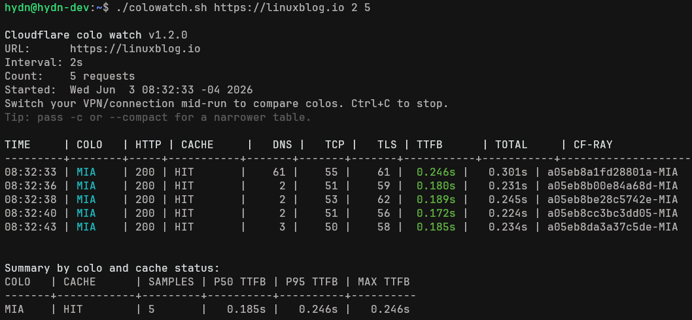

# cf-colo-watcher

A small bash script that shows which [Cloudflare](https://www.cloudflare.com/) colo (datacenter) is serving each request, along with cache status, TTFB, and Cloudflare's own edge processing time.

For background on why this exists, see [the post on linuxblog.io](https://linuxblog.io/cloudflare-data-center-watcher/).

## Why

Cloudflare routes each request through one of its edge locations (colos) based on anycast and current network conditions, so the same site can be served from different colos depending on the client's ISP and geography. This script gives you a live view of which colo is serving you, the cache status, full timing breakdown, and Cloudflare's own server-timing measurement (one line per request), so you can see how performance varies across colos and over time.

Run it, switch VPN/connection mid-run, and watch the colo change. The timing column tells the story.

## Example output



Default (compact) mode:

```
Cloudflare colo watch v1.1.0
URL:      https://example.com
Interval: 5s
Started:  Mon May  4 14:25:00 EDT 2026
Switch your VPN/connection mid-run to compare colos. Ctrl+C to stop.
Tip: pass -d or --detailed for DNS/TCP/TLS breakdown.

TIME     | COLO   | HTTP | CACHE     | TTFB      | TOTAL     | CF-DUR  | CF-RAY
---------+--------+------+-----------+-----------+-----------+---------+--------------------------
14:25:03 | MIA    | 200  | HIT       |  0.218s   |   0.231s  |    4.1  | 9f6971eeff87f51d-MIA
14:25:09 | MIA    | 200  | HIT       |  0.241s   |   0.255s  |    3.8  | 9f69729eda573043-MIA
14:25:14 | MIA    | 200  | DYNAMIC   |  0.387s   |   0.402s  |  152.3  | 9f6970ea8abbdab9-MIA
─── colo changed: MIA → EWR ───
14:25:20 | EWR    | 200  | HIT       |  0.176s   |   0.189s  |    3.6  | 9f6970ea8abbdab9-EWR
14:25:25 | EWR    | 200  | DYNAMIC   |  0.312s   |   0.331s  |  148.7  | 9f6970ea8abbdab9-EWR

Summary by colo and cache status:
COLO   | CACHE      | SAMPLES | P50 TTFB | P95 TTFB | MAX TTFB
-------+------------+---------+----------+----------+----------
MIA    | HIT        | 2       |   0.218s |   0.241s |   0.241s
MIA    | DYNAMIC    | 1       |   0.387s |   0.387s |   0.387s
EWR    | HIT        | 1       |   0.176s |   0.176s |   0.176s
EWR    | DYNAMIC    | 1       |   0.312s |   0.312s |   0.312s
```

Detailed mode (`-d` / `--detailed`) adds DNS, TCP, and TLS handshake times in milliseconds:

```
TIME     | COLO   | HTTP | CACHE     |   DNS |   TCP |   TLS | TTFB      | TOTAL     | CF-DUR  | CF-RAY
---------+--------+------+-----------+-------+-------+-------+-----------+-----------+---------+--------------------------
14:25:03 | MIA    | 200  | HIT       |     7 |    55 |    58 |  0.218s   |   0.231s  |    4.1  | 9f6971eeff87f51d-MIA
```

Columns:

- **TTFB** - client-side time to first byte (cumulative: DNS + TCP + TLS + server response)
- **TOTAL** - full request/response time
- **CF-DUR** - Cloudflare's own `cfRequestDuration` from the `server-timing` header, in ms. Shows `-` when the zone doesn't emit `server-timing`. Useful for separating edge processing from network/TLS time.
- **CF-RAY** - Cloudflare ray ID; the suffix after the dash is the colo

TTFB is color-coded in the live output:

- Green: under 500ms
- Yellow: 500ms to 1s
- Red: over 1s

When the colo changes between requests (e.g. you switched VPN regions), a divider line is printed so the transition is easy to spot in scrollback.

## Usage

```bash
./colowatch.sh [options] <url> [interval] [count]
```

Options:

- `-d`, `--detailed` - show DNS/TCP/TLS timing breakdown
- `--csv FILE` - write all samples as CSV to `FILE`
- `--json FILE` - write all samples as JSON Lines to `FILE`
- `-h`, `--help` - show help

Positional:

- `url` - required, the URL to test
- `interval` - optional, seconds between requests (default 5)
- `count` - optional, stop after N requests (default 0 = run until Ctrl+C)

Examples:

```bash
./colowatch.sh https://example.com
./colowatch.sh -d https://example.com 3
./colowatch.sh --csv runs.csv https://example.com 5 50
./colowatch.sh --json runs.jsonl https://example.com 5 100
./colowatch.sh https://example.com 5 50 | tee results.log
```

Press Ctrl+C at any time to stop and see the per-(colo, cache) summary. If `count` is set, the summary prints automatically when it finishes. The CSV/JSON files are written on exit.

### Output formats

CSV (RFC 4180, one sample per row):

```
timestamp,colo,cache,http_code,dns_ms,tcp_ms,tls_ms,ttfb_s,total_s,cf_req_duration_ms,cf_ray,server_timing
2026-05-04T14:25:03-0400,MIA,HIT,200,7,55,58,0.218,0.231,4.1,9f6971eeff87f51d-MIA,"cfL4;desc=""?proto=TCP&rtt=12345"",cfRequestDuration;dur=4.1"
```

JSON Lines (one JSON object per line):

```json
{"timestamp":"2026-05-04T14:25:03-0400","colo":"MIA","cache":"HIT","http_code":200,"dns_ms":7,"tcp_ms":55,"tls_ms":58,"ttfb_s":0.218,"total_s":0.231,"cf_req_duration_ms":4.1,"cf_ray":"9f6971eeff87f51d-MIA","server_timing":"cfL4;desc=\"?proto=TCP&rtt=12345\",cfRequestDuration;dur=4.1"}
```

Both formats include the raw `server-timing` header so you can extract other Cloudflare-emitted fields downstream.

## Install

```bash
curl -O https://raw.githubusercontent.com/haydenjames/cf-colo-watcher/main/colowatch.sh
chmod +x colowatch.sh
```

Or clone the repo:

```bash
git clone https://github.com/haydenjames/cf-colo-watcher.git
cd cf-colo-watcher
chmod +x colowatch.sh
```

## Requirements

- bash 3.2+ (works with the default `/bin/bash` on macOS, no `brew install bash` needed)
- curl
- awk
- sort

Tested on Linux and macOS.

## How it works

Each request returns a `cf-ray` header whose suffix is the colo code (e.g. `9f6971eeff87f51d-MIA` means Miami). The script also reads `cf-cache-status` and Cloudflare's `server-timing` header, and combines those with curl's timing measurements to produce one row per request.

The per-(colo, cache) summary is computed from the in-memory sample log on exit, with p50/p95/max TTFB so a single outlier doesn't dominate the picture.

Tracking these over time, especially while switching VPN locations, gives you a per-colo picture of cache behavior, edge processing time, and client-perceived latency.

## Use cases

- Reproducing geography-specific user reports (different ISPs route to different colos)
- Measuring before/after impact of caching, Argo Smart Routing, or Tiered Cache changes
- Comparing cached (HIT) vs uncached (DYNAMIC) request behavior on your zones
- Separating Cloudflare edge time (`CF-DUR`) from network/TLS overhead on slow requests
- Capturing concrete TTFB and `cf-ray` data when working with support on routing questions
- Sanity-checking which colo a region is actually being served by

## Tips

- For long monitoring runs, use `--csv` (or `--json`) so you can analyze later in a spreadsheet or with `jq`
- Use a low interval (3 seconds) for short A/B tests, longer (10+) for sustained monitoring
- If `CF-DUR` is consistently `-`, the zone is not emitting `server-timing`; the rest of the columns still work
- If you see a colo column showing `???`, the request failed before getting a Cloudflare response - check connectivity
- The script makes one curl per cycle and parses its headers, so each row represents a single round trip

## License

MIT
